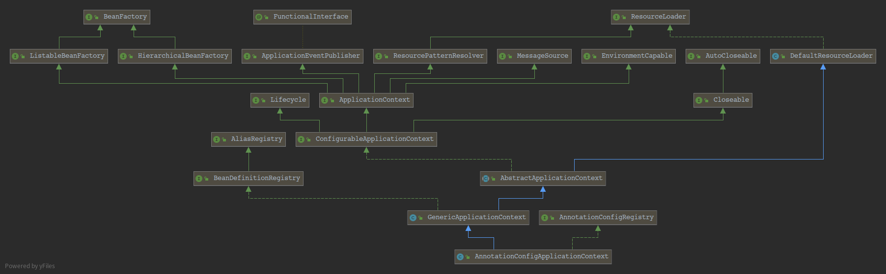

AnnotationConfigApplicationContext 继承结构图

prepareRefresh(): 为 refresh 做一些准备. 准备此上下文以进行刷新，设置其启动日期和活动标志以及执行属性源的任何初始化。

ConfigurableListableBeanFactory beanFactory = obtainFreshBeanFactory():告诉子类去刷新内部的 Bean Factory.

prepareBeanFactory(beanFactory): 使用这个context刷新 Bean Factory.

postProcessBeanFactory(beanFactory): 允许在上下文子类中对bean工厂进行后处理. 标准初始化后，修改应用程序上下文的内部bean工厂。所有bean定义都将被加载，但尚未实例化任何bean。这允许在某些ApplicationContext实现中注册特殊的BeanPostProcessor等。

invokeBeanFactoryPostProcessors(beanFactory): 调用在上下文中注册为bean的工厂处理器。

registerBeanPostProcessors(beanFactory): 注册拦截Bean创建的Bean处理器.

initMessageSource(): 初始化 message source

initApplicationEventMulticaster(): 初始化 Application 时间多播器

onRefresh(): 初始化特定上下文子类中的其它特别的Bean

registerListeners(): 校验监听器 Bean 并注册.

finishBeanFactoryInitialization(beanFactory): 初始化所有剩余的non-lazy的单例Bean

finishRefresh(): 发布相应的事件
